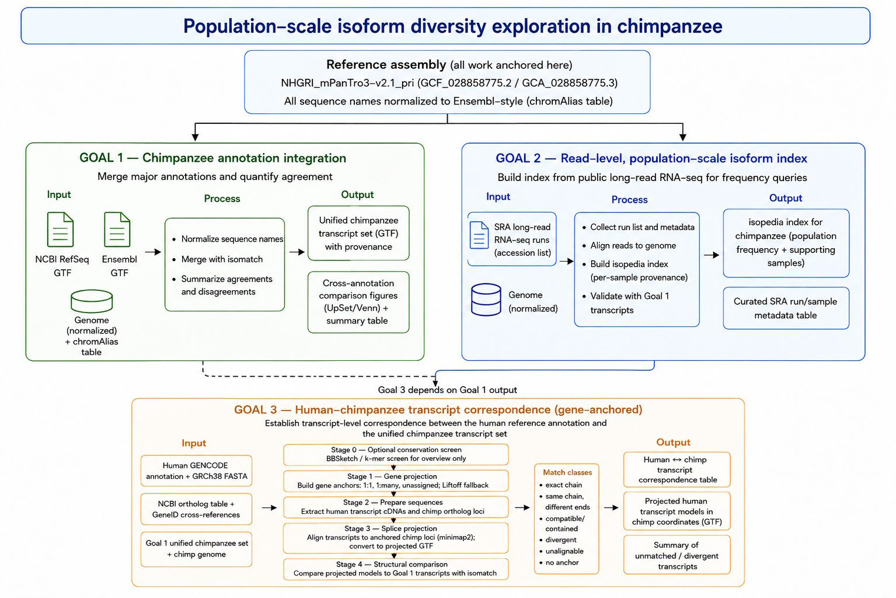

# **IsoChimp: Population-scale isoform diversity exploration in chimpanzee**

  

## **Motivation**

The chimpanzee (*Pan troglodytes*) is a key species for comparative and evolutionary genomics, but its transcriptome annotation is fragmented across providers — NCBI RefSeq, Ensembl, and others — each with its own gene models, identifiers, and inclusion criteria. No systematic comparison of these resources currently exists, there is no way to ask a basic question about any chimpanzee transcript — **how common is it across individuals?** — and there is no transcript-level correspondence to the human annotation on the current chimpanzee assembly.

This project addresses all three gaps, as three goals:

1. **Annotation integration.** Merge the major public chimpanzee annotations into a single unified transcript set, and quantify how much they agree and disagree.  
2. **Population-scale isoform index.** Build a read-level index of transcript evidence from public long-read RNA-seq, so that any transcript can be queried for its population frequency and the samples supporting it.  
3. **Human–chimpanzee correspondence.** Map human transcripts onto the chimpanzee assembly and match them against the unified set, so human and chimpanzee isoforms can be compared directly.

The result is a reference transcript set, a queryable population-frequency index, and a human–chimpanzee transcript correspondence table — together letting other groups assess the prevalence of transcripts they detect in their own chimpanzee samples and relate them to human isoforms.

goals 1 and 2 are independent and run in parallel. goal 3 depends on the goal 1 output.

flowchart

## **Reference assembly and conventions**

All work is anchored to a single assembly to avoid coordinate mismatches:

| Item | Value |
| ----- | ----- |
| Assembly | NHGRI\_mPanTro3-v2.1\_pri |
| RefSeq accession | GCF\_028858775.2 |
| GenBank accession | GCA\_028858775.3 |

* Genome FASTA: `https://ftp.ncbi.nlm.nih.gov/genomes/all/GCF/028/858/775/GCF_028858775.2_NHGRI_mPanTro3-v2.1_pri/GCF_028858775.2_NHGRI_mPanTro3-v2.1_pri_genomic.fna.gz`  
* Sequence-name alias table (RefSeq `NC_*` / GenBank `CM_*` / UCSC `chr*`): `https://hgdownload.soe.ucsc.edu/hubs/GCF/028/858/775/GCF_028858775.2/GCF_028858775.2.chromAlias.txt`

**Naming convention.** All annotations, genome FASTAs, and alignments are normalised to Ensembl/GENCODE-style sequence names (bare numbers, no `chr` prefix) via the chromAlias table before any comparison or merging step. This includes renaming the chimpanzee genome FASTA itself, since read alignments (goal 2\) and lifted annotations (goal 3\) inherit their sequence names from it. Scaffolds absent from the alias table retain their RefSeq accession; the count of such records is reported so the loss is explicit.

---

## **goal 1 — Chimpanzee annotation integration**

**Goal.** Produce a unified transcript set from multiple reference annotations, and systematically characterise where those annotations agree and where they diverge.

**Input.**

* NCBI RefSeq annotation (release RS\_2026\_05): `https://ftp.ncbi.nlm.nih.gov/genomes/all/annotation_releases/9598/GCF_028858775.2-RS_2026_05/GCF_028858775.2_NHGRI_mPanTro3-v2.1_pri_genomic.gtf.gz`  
* Ensembl annotation (geneset 2025\_05, on GCA\_028858775.3): `https://ftp.ebi.ac.uk/pub/ensemblorganisms/Pan_troglodytes/GCA_028858775.3/ensembl/geneset/2025_05/genes.gtf.gz`  
* Reference genome FASTA and chromAlias table (above)  
* `isomatch` — https://github.com/zhengxinchang/isomatch

**Steps.**

1. Normalise sequence names in both GTFs and in the genome FASTA to the project convention using the chromAlias table.  
2. Merge with `isomatch`, treating each annotation source as a tracked sample.  
3. Summarise the merge: transcripts unique to each source, shared transcripts, and the nature of the disagreements (exact intron-chain match vs. shared structure with different transcript boundaries).

**Output.**

1. A unified chimpanzee transcript set (GTF) with provenance for every transcript.  
2. Cross-annotation comparison figures — an UpSet plot (or Venn diagram) of transcript overlap between sources, plus a short summary table of per-source counts.

---

## **goal 2 — Read-level, population-scale isoform index**

**Goal.** Build an index of transcript evidence at the level of individual long reads, aggregated across all publicly available chimpanzee long-read RNA-seq samples, supporting population-frequency queries for arbitrary query transcripts.

**Input.**

* Public chimpanzee long-read RNA-seq runs from SRA, as a fixed list of run accessions (BioProject IDs and the accession list are recorded in the project repository; session links to the SRA Run Selector are not stable and are not used)  
* Reference genome, normalised as above  
* `isopedia` — https://github.com/zhengxinchang/isopedia

**Steps.**

1. Assemble the run accession list with sample metadata (tissue, individual, platform, library protocol).  
2. Align reads to the reference assembly.  
3. Build the `isopedia` index over the aligned reads, retaining per-sample provenance.  
4. Validate with a query round-trip: take transcripts from the goal 1 unified set and confirm the index returns sensible support counts and sample lists.

**Output.**

1. A chimpanzee read-level `isopedia` index supporting transcript queries that return population frequency and the list of supporting samples.  
2. The curated SRA run/sample metadata table used to build it.

---

## goal 3 — Human–chimpanzee transcript correspondence (gene-anchored)

**Goal.** Establish a transcript-level correspondence between the human reference annotation and the chimpanzee transcript set on NHGRI\_mPanTro3-v2.1\_pri, so that human and chimpanzee isoforms can be compared directly.

No precomputed transcript-level mapping is usable here (TOGA and UCSC chains target panTro6 / Clint\_PTRv2). However, gene-level orthology *is* available: NCBI's annotation pipeline assigns human orthologs to the RefSeq annotation of GCF\_028858775.2. The strategy is therefore two-stage: first fix the correspondence at the gene level, then compare transcript structures within each orthologous gene pair.

**Approach.** Stage 1 (gene projection): anchor each human gene to its chimpanzee ortholog using the NCBI RefSeq ortholog assignments (harmonised GeneIDs / gene symbols), classifying pairs as 1:1, 1:many, or unassigned. For unassigned human genes, fall back to Liftoff to propose a candidate locus, flagged as projection-by-lift (lower confidence). Stage 2 (within-gene transcript comparison): splice-align the human transcript sequences of each gene onto its chimpanzee ortholog locus, convert the alignments to exon models in chimpanzee coordinates, and match them against the goal 1 unified chimpanzee transcripts at that locus using the same intron-chain logic (isomatch). Intron-chain identity is the primary criterion; cDNA alignment identity and coverage are recorded as supporting statistics, since sequence identity alone cannot distinguish splice-structure differences.

Because every alignment is confined to a pre-established ortholog locus, paralog mis-mapping is excluded by construction, and every failure is attributable to a specific cause (no ortholog gene, unalignable transcript, or structural divergence).

**Input.**

* Human reference annotation (GENCODE comprehensive GTF) and GRCh38 primary assembly FASTA: [https://ftp.ebi.ac.uk/pub/databases/gencode/Gencode\_human/latest\_release/](https://ftp.ebi.ac.uk/pub/databases/gencode/Gencode_human/latest_release/)  
* NCBI RefSeq annotation and gene-level ortholog assignments for GCF\_028858775.2 (via NCBI Datasets ortholog query); GENCODE↔GeneID cross-references  
* Chimpanzee reference genome FASTA, normalised as above  
* Unified chimpanzee transcript set from goal 1  
* gffread, minimap2, Liftoff (fallback only), isomatch

**Steps.**

1. Build the gene projection table: human GeneID ↔ chimpanzee GeneID from NCBI orthologs; map GENCODE gene IDs to Entrez GeneIDs; classify each human gene as 1:1, 1:many, or unassigned. For unassigned genes, run Liftoff restricted to gene features to propose a candidate locus.  
2. For each projected gene pair, extract human transcript sequences with gffread and the chimpanzee ortholog locus sequence (± \~10 kb margin) from the assembly.  
3. Splice-align each human transcript to its target locus (`minimap2 -ax splice:hq`, optionally guided by chimpanzee junctions from goal 1), and convert alignments to GTF exon chains in chimpanzee coordinates. For 1:many orthologs, align to all candidate loci and keep the best-scoring placement; report ties.  
4. Match the projected human transcript models against the goal 1 unified set restricted to the same locus with isomatch, treating the projection as an additional tracked sample.  
5. Classify each human transcript as: identical intron chain, compatible (ISM/contained), structurally divergent, unalignable within the locus, or no ortholog gene (lift-only or unplaced).

Goal 3 Steps: Numrah 

## **Stage 0: Fast sequence-conservation screen :** For every human transcript, estimate whether there is substantial homologous sequence in the chimpanzee genome and generate an intuitive “highly conserved versus divergent/unmapped” overview.

**Stage 0 steps** 

1. Extract all human transcript cDNAs from GENCODE using `gffread`.  
2. Optionally create separate FASTA sets for:  
   * All transcripts.  
   * Canonical/MANE Select transcripts only.  
   * CDS-only sequences.  
   * Full spliced cDNAs including UTRs.  
3. Run BBSketch or a comparable k-mer screen against the chimpanzee genome/locus database.  
4. Record:  
   * Fraction of human transcripts with high k-mer similarity.  
   * Distribution of estimated sequence identity/shared k-mers.  
   * Results stratified by transcript type: protein-coding, lncRNA, pseudogene, retained-intron transcript, canonical/MANE.  
5. Use this only to prioritize or flag difficult genes; do not classify “no perfect BBSketch match” as chimpanzee absence.

A perfect full-length cDNA match is too strict for cross-species transcript correspondence. More important, the biological question is whether the transcript has the same splice structure at its orthologous genomic locus, not whether every base including UTRs matches perfectly. For a smaller, controlled set of canonical transcripts, BBSketch can be a useful “sanity plot,” but the formal comparison should rely on splice-aware placement plus intron-chain comparison.

**Stage 0 Output.**

1. A human ↔ chimpanzee transcript correspondence table: human transcript → chimpanzee transcript(s), gene anchor and its provenance (NCBI ortholog vs Liftoff fallback), match category, alignment identity/coverage.  
2. The projected human transcript models in chimpanzee coordinates (GTF), reusable as an additional annotation source.  
3. A summary of human transcripts with no chimpanzee counterpart, stratified by reason (no ortholog gene / lift-only locus / unalignable / structurally divergent).

## **Stage 1: Build the gene-projection table**

## 1\. Map human annotation to orthology IDs

* Extract human gene and transcript records from GENCODE.  
* Join GENCODE genes to Entrez GeneIDs.  
* Retrieve NCBI chimpanzee ortholog assignments for human GeneIDs.  
* Join NCBI chimp GeneIDs to the RefSeq/Goal 1 chimpanzee annotation.

## 2\. Classify each human gene

Assign one mutually exclusive gene-anchor category:

| Gene-anchor category | Definition | Downstream action |
| ----- | ----- | ----- |
| High-confidence 1:1 ortholog | One human GeneID maps to one chimp GeneID | Primary analysis set |
| One-to-many ortholog | One human gene maps to multiple chimp loci | Evaluate each locus; retain best and report ties |
| Many-to-one / complex | Multiple human genes converge on a chimp gene or complex orthology | Flag; analyze conservatively |
| Chimp ortholog exists but absent from Goal 1 GTF | Ortholog table identifies locus but annotation is incomplete | Use locus sequence; report annotation absence |
| No NCBI ortholog | No assigned chimpanzee ortholog | Liftoff fallback, lower confidence |
| Mapping failure | Human GENCODE gene cannot be linked to GeneID | Retain separately; symbol-based rescue only if unambiguous |

## **Stage 2: Prepare transcript and locus sequence sets**

## For each gene anchor

1. Extract all human transcript models for the human gene from GENCODE.  
2. Extract transcript cDNA FASTA with `gffread`.  
3. Extract the chimpanzee genomic locus:  
   * Ortholog gene body.  
   * Add a flank, initially ±10 kb.  
   * Expand adaptively if a transcript aligns near a locus boundary or has unaligned terminal sequence.  
4. Extract Goal 1 chimpanzee transcript models overlapping the same gene/locus.  
5. Keep transcript biotype, CDS status, canonical/MANE flags, and UTR/CDS exon coordinates.

## **Stage 3: Splice-project human isoforms onto chimpanzee loci**

For each human transcript cDNA:

1. Align to the pre-established chimpanzee ortholog locus using splice-aware minimap2.  
2. Use `splice:hq` for high-quality full-length cDNA / Iso-Seq-like query sequences.  
3. Preserve secondary alignments only where needed to resolve duplicated exons or 1:many orthologs.  
4. Retain alignment metrics:  
   * MAPQ.  
   * Primary versus secondary status.  
   * Aligned query coverage.  
   * Reference coverage.  
   * Number of aligned exons.  
   * Number and length of indels.  
   * Per-exon alignment identity.  
   * Splice-junction motif and confidence.  
   * Soft-clipped 5′ and 3′ sequence.

Minimap2 supports splice-aware mapping of cDNA and long RNA sequences; its documented high-quality splice preset is `-ax splice:hq` with `-uf` for PacBio Iso-Seq/traditional cDNA orientation.[github](https://github.com/lh3/minimap2)

## **Convert alignments to projected GTF models**

For each accepted primary placement:

* Convert CIGAR `N` operations into introns.  
* Convert aligned blocks into exon intervals.  
* Assign projected transcript IDs such as:

text

`HUMANPROJ_<ENST>__to__<chimp_gene_id>`

* Retain alignment metadata in GTF attributes:  
  * `human_transcript_id`  
  * `human_gene_id`  
  * `chimp_gene_id`  
  * `orthology_source`  
  * `mapq`  
  * `qcov`  
  * `identity`  
  * `alignment_status`

## **Stage 4: Compare projected and chimpanzee isoforms** Primary structural comparison: intron-chain logic

For each projected human transcript, identify all chimpanzee Goal 1 transcripts at the anchored locus and classify:

| Transcript match class | Operational definition |
| ----- | ----- |
| Exact intron-chain match | Same ordered intron coordinates and same strand; terminal exon differences reported separately |
| Exact splice structure, variable ends | Same intron chain, but different TSS and/or TES boundaries |
| Compatible / contained | One intron chain is a contiguous subset of the other; likely ISM, truncation, or incomplete annotation |
| Junction overlap, divergent structure | Shares one or more junctions but has added, skipped, shifted, or mutually exclusive exons |
| Sequence-supported but no annotated chimp isoform | Human projection is coherent but has no Goal 1 structural match |
| Locus-aligned but structurally ambiguous | Poor edge confidence, short exon ambiguity, or competing splice placement |
| Unalignable in ortholog locus | No sufficient placement to form a projection |
| No gene anchor | No NCBI ortholog and no accepted Liftoff placement |

## **Secondary sequence comparison**

For the best structural match and/or all plausible matches, calculate:

* Full-cDNA alignment identity and coverage.  
* CDS-only identity and coverage for protein-coding transcripts.  
* Number of splice-junction substitutions or shifts.  
* 5′ and 3′ end differences separately.

## **Stage 5: QC and validation \- TBD** 

