# **IsoChimp: Population-scale isoform diversity exploration in chimpanzee**

  

## **Motivation**

The chimpanzee (*Pan troglodytes*) is a key species for comparative and evolutionary genomics, but its transcriptome annotation is fragmented across providers — NCBI RefSeq, Ensembl, and others — each with its own gene models, identifiers, and inclusion criteria. No systematic comparison of these resources currently exists, there is no way to ask a basic question about any chimpanzee transcript — **how common is it across individuals?** — and there is no transcript-level correspondence to the human annotation on the current chimpanzee assembly.

This project addresses all three gaps, as three goals:

1. **Annotation integration:** Merge the major public chimpanzee annotations into a single unified transcript set, and quantify how much they agree and disagree.  
2. **Population-scale isoform index:** Build a read-level index of transcript evidence from public long-read RNA-seq, so that any transcript can be queried for its population frequency and the samples supporting it.  
3. **Human–chimpanzee correspondence:** Map human transcripts onto the chimpanzee assembly and match them against the unified set, so human and chimpanzee isoforms can be compared directly.

The result is a reference transcript set, a queryable population-frequency index, and a human–chimpanzee transcript correspondence table — together letting other groups assess the prevalence of transcripts they detect in their own chimpanzee samples and relate them to human isoforms.

Goals 1 and 2 are independent and run in parallel while goal 3 depends on the output of goal 1.

Flowchart

## **Reference assembly and conventions**

All work is anchored to a single assembly to avoid coordinate mismatches:

| Item | Value |
| ----- | ----- |
| Assembly | NHGRI\_mPanTro3-v2.1\_pri |
| RefSeq accession | GCF\_028858775.2 |
| GenBank accession | GCA\_028858775.3 |

* Genome FASTA: `https://ftp.ncbi.nlm.nih.gov/genomes/all/GCF/028/858/775/GCF_028858775.2_NHGRI_mPanTro3-v2.1_pri/GCF_028858775.2_NHGRI_mPanTro3-v2.1_pri_genomic.fna.gz`  
* Sequence-name alias table (RefSeq `NC_*` / GenBank `CM_*` / UCSC `chr*`): `https://hgdownload.soe.ucsc.edu/hubs/GCF/028/858/775/GCF_028858775.2/GCF_028858775.2.chromAlias.txt`

**Naming convention.** All annotations, genome FASTAs, and alignments are normalised to Ensembl/GENCODE-style sequence names (bare numbers, no `chr` prefix) via the chromAlias table before any comparison or merging step. This includes renaming the chimpanzee genome FASTA itself, since read alignments (goal 2\) and lifted annotations (goal 3\) inherit their sequence names from it. Scaffolds absent from the alias table retain their RefSeq accession; the count of such records is reported so the loss is explicit.

---

## **Goal 1 — Chimpanzee annotation integration**

**Goal:** Produce a unified transcript set from multiple reference annotations, and systematically characterize where those annotations agree and where they diverge.

**Input**

* NCBI RefSeq annotation (release RS\_2026\_05): `https://ftp.ncbi.nlm.nih.gov/genomes/all/annotation_releases/9598/GCF_028858775.2-RS_2026_05/GCF_028858775.2_NHGRI_mPanTro3-v2.1_pri_genomic.gtf.gz`  
* Ensembl annotation (geneset 2025\_05, on GCA\_028858775.3): `https://ftp.ebi.ac.uk/pub/ensemblorganisms/Pan_troglodytes/GCA_028858775.3/ensembl/geneset/2025_05/genes.gtf.gz`  
* Reference genome FASTA and chromAlias table (above)  
* `isomatch` — https://github.com/zhengxinchang/isomatch

**Steps**

1. **Download the inputs**  
   1. NCBI RefSeq GTF  
   2. Ensembl GTF  
   3. Chimpanzee reference genome FASTA  
   4. `chromAlias` table  
2. **Standardize chromosome names**  
   1. Normalize chromosome names in both GTFs and the reference genome to the same convention.  
   2. Use **Ensembl-style chromosome names** (e.g. `1`, `2`, `X`, without the `chr` prefix).  
   3. Use the `chromAlias` table when necessary to map RefSeq/GenBank/UCSC chromosome names.  
3. **Merge the two annotations with IsoMatch**  
   1. Run the IsoMatch `merge` function using the two normalized GTFs and the normalized reference genome.  
   2. Keep RefSeq and Ensembl as separate tracked sources.  
   3. The merged GTF should contain provenance information such as `ISOM_SRC` and other IsoMatch attributes.  
4. **Parse the merged GTF and summarize annotation overlap**  
   Calculate at least:  
   1. Total number of transcripts in RefSeq and Ensembl  
   2. Number of **mono-exon** and **multi-exon** transcripts in each annotation  
   3. Number and percentage of transcripts **shared between RefSeq and Ensembl**  
   4. Number of transcripts **unique to RefSeq**  
   5. Number of transcripts **unique to Ensembl**  
   6. If possible, distinguish **exact intron-chain matches** from transcripts with the same splice structure but different transcript boundaries.  
5. **Generate summary outputs**  
   1. A unified chimpanzee annotation GTF with source provenance  
   2. A small summary table of transcript counts and overlap  
   3. An **UpSet plot or Venn diagram** showing RefSeq/Ensembl shared and unique transcripts

**Output**

1. A unified chimpanzee transcript set (GTF) with provenance for every transcript.  
2. Cross-annotation comparison figures — an UpSet plot (or Venn diagram) of transcript overlap between sources, plus a short summary table of per-source counts.

---

## **Goal 2 — Read-level, population-scale isoform index**

**Goal:** Build an index of transcript evidence at the level of individual long reads, aggregated across all publicly available chimpanzee long-read RNA-seq samples, supporting population-frequency queries for arbitrary query transcripts.

**Input**

* Public chimpanzee long-read RNA-seq runs from SRA, as a fixed list of run accessions (BioProject IDs and the accession list are recorded in the project repository; session links to the SRA Run Selector are not stable and are not used)  
* Reference genome, normalised as above  
* `isopedia` — https://github.com/zhengxinchang/isopedia

**Steps**

1. **Curate chimpanzee long-read RNA-seq datasets**  
   1. Combine SRA run information with sample metadata.  
   2. Identify tissue, individual, platform, and library type.  
   3. Filter out unsuitable runs, including raw PacBio subreads when processed reads are available, datasets without usable transcript reads, and targeted experiments.  
   4. Generate the final SRR list and a QC/audit table.  
2. **Current result: 17 suitable samples identified.**  
3. **Prepare the reference**  
   1. Normalize chromosome names in the chimpanzee genome and GTF to the same convention.  
   2. Build the required `samtools` and `minimap2` indexes.  
4. **Download and align the selected runs**  
   1. Download FASTQ files for the approved SRR accessions.  
   2. Verify downloads with MD5 checksums.  
   3. Align reads to the normalized chimpanzee genome with splice-aware `minimap2`.  
   4. Sort/index BAM files and merge runs belonging to the same BioSample.  
   5. Calculate basic alignment QC, including mapped reads and mapping rate.  
5. **Build the Isopedia index**  
   1. Build a population-scale `isopedia` index from the cleaned BAM files while retaining sample provenance.  
6. **Query transcript set**   
   1. Use the unified chimpanzee GTF from Goal 1 as the query or use ENSEMBL gene.gtfs as an anternative.  
   2. Summarize transcript support, including:  
      1. Supporting reads  
      2. Supporting samples  
      3. Population frequency  
      4. Sample IDs  
7. **Generate summary outputs**  
   1. Curated sample metadata and inclusion/exclusion table  
   2. QCed BAM files  
   3. Chimpanzee `isopedia` population index  
   4. Goal 1 transcripts annotated with population support  
   5. Basic population-frequency and sample-support statistics

**Output**

1. A chimpanzee read-level `isopedia` index supporting transcript queries that return population frequency and the list of supporting samples.  
2. The curated SRA run/sample metadata table used to build it.

---

## Goal 3 — Human–chimpanzee transcript correspondence (gene-anchored)

**Goal**: Establish a **transcript-level correspondence between human and chimpanzee isoforms** on `NHGRI_mPanTro3-v2.1_pri`.
The analysis is **gene-anchored**: first identify the corresponding chimpanzee gene/locus for each human gene, then compare transcript structures within that locus. Splice-structure similarity is the primary criterion, while sequence identity and coverage are used as supporting information.

**Input**

* Human GENCODE comprehensive GTF and GRCh38 reference genome  
* NCBI human–chimpanzee gene orthology assignments  
* Normalized chimpanzee reference genome  
* Unified chimpanzee transcript annotation from **Goal 1**  
* `gffread`  
* `minimap2`  
* `Liftoff` — fallback for genes without an NCBI ortholog  
* `isomatch`  
* `BBSketch` or similar tool — optional conservation screen

**Steps**

1. **Optional sequence-conservation screen**  
   * Extract human transcript cDNAs with `gffread`.  
   * Use `BBSketch` or a similar method to estimate human–chimpanzee sequence conservation.  
   * Use this as a QC/sanity check rather than the formal transcript-matching criterion.  
2. **Build the human–chimpanzee gene projection table**  
   * Map GENCODE genes to Entrez GeneIDs.  
   * Retrieve chimpanzee orthologs from NCBI.  
   * Classify gene relationships as:  
     * 1:1 ortholog  
     * 1 / complex  
     * No assigned ortholog  
   * For genes without an NCBI ortholog, use `Liftoff` as a lower-confidence fallback.  
3. **Project human transcripts onto chimpanzee loci**  
   * Extract human transcript sequences and their corresponding chimpanzee ortholog loci.  
   * Splice-align human transcripts to the assigned chimpanzee locus using `minimap2`.  
   * Convert the alignments into projected chimpanzee-coordinate GTF transcript models.  
   * Record alignment identity, coverage, MAPQ, and other basic QC metrics.  
4. **Compare projected transcripts with Goal 1 annotations**  
   * Compare projected human transcript models against the unified chimpanzee GTF using `isomatch`.  
   * Use **intron-chain/splice-structure similarity as the primary comparison**.  
   * Classify transcripts into categories such as:  
     * Exact intron-chain match  
     * Same splice structure with different transcript ends  
     * Compatible / contained  
     * Structurally divergent  
     * Projected but no annotated chimpanzee isoform  
     * Unalignable / no gene anchor  
5. **Summarize and validate**  
   * Calculate the proportion of human transcripts with conserved chimpanzee counterparts.  
   * Summarize structural-match categories and alignment identity/coverage.  
   * Report transcripts without a counterpart and the reason for failure.

**Output**

1. A **human ↔ chimpanzee transcript correspondence table** containing gene anchor, chimpanzee transcript match, structural category, alignment identity, and coverage.  
2. Human transcript projections in **chimpanzee coordinates (GTF)**.  
3. Summary statistics/figures showing:  
   * Conserved versus divergent transcript structures  
   * Distribution of sequence identity/coverage  
   * Human transcripts without a chimpanzee counterpart, stratified by reason.

## **Results**

### **Goal 1 — Chimpanzee annotation integration**

RefSeq (RS_2026_05) and Ensembl (geneset 2025_05) were normalised to a common chromosome naming convention and merged with IsoMatch under two stringency models: a *strict* model requiring exact agreement of splice junctions, transcription start sites, and transcription end sites, and a *relaxed* model requiring agreement of internal splice junctions only. The comparison shows strong consensus between the two annotations on the physical locations of transcribed loci, but extensive divergence at the isoform level.

**Transcript-level comparison (strict boundaries).** Under strict matching, only 19,819 transcripts are shared between the two sources — 19,785 with exact splice and boundary matches and 34 with the same splice structure but different transcript ends.

| Transcript annotation metric | Count |
| ----- | ----- |
| Total RefSeq transcripts | 135,455 |
| — Multi-exon | 128,338 |
| — Mono-exon | 7,117 |
| Total Ensembl transcripts | 101,944 |
| — Multi-exon | 77,218 |
| — Mono-exon | 24,726 |
| Shared transcripts | 19,819 |
| — Exact splice & boundary match | 19,785 |
| — Structural match / boundary difference | 34 |
| Unique to RefSeq | 115,636 |
| Unique to Ensembl | 82,125 |

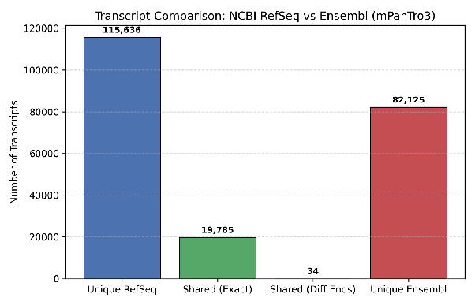

**Gene-level comparison.** In contrast to the transcript level, the majority of RefSeq gene loci (24,685 of 34,472) overlap an Ensembl locus, confirming that the two databases largely agree on where transcription occurs and diverge mainly in how isoforms are modelled.

| Gene annotation metric | Count |
| ----- | ----- |
| Total RefSeq genes | 34,472 |
| Total Ensembl genes | 52,414 |
| Shared genes (overlapping loci) | 24,685 |
| Unique to RefSeq | 9,787 |
| Unique to Ensembl | 27,729 |

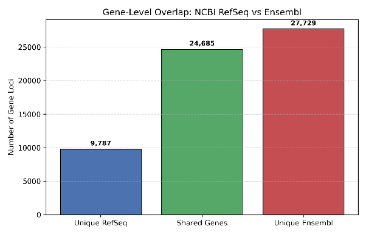

**Effect of transcript boundaries.** Relaxing the match criterion to internal splice junctions only raises the number of shared multi-exon transcripts from ~6,300 (strict) to 16,134, showing that differing 5′/3′ UTR definitions account for a large fraction of the apparent transcript-level divergence. Stratifying the relaxed merge by exon count also exposes a pronounced mono-exon imbalance: 21,041 mono-exon transcripts are unique to Ensembl versus 3,432 unique to RefSeq.

| Transcript overlap (splice junctions only) | Count |
| ----- | ----- |
| **Multi-exon transcripts (high confidence)** |  |
| — Shared | 16,134 |
| — Unique to RefSeq | 112,204 |
| — Unique to Ensembl | 61,084 |
| **Mono-exon transcripts (lower confidence)** |  |
| — Shared | 3,685 |
| — Unique to RefSeq | 3,432 |
| — Unique to Ensembl | 21,041 |

**Biotype composition of source-unique genes.** Ensembl's larger unique gene set is driven almost entirely by single-exon, non-coding elements — over 85% of its unique genes are lncRNAs or misc_RNAs — reflecting RefSeq's higher evidence threshold for annotating single-exon non-coding elements.

| Biotype of unique Ensembl genes | Count | | Biotype of unique RefSeq genes | Count |
| ----- | ----- | ----- | ----- | ----- |
| lncRNA | 18,557 | | lncRNA | 6,155 |
| misc_RNA | 5,384 | | protein_coding | 2,834 |
| protein_coding | 1,694 | | tRNA | 505 |
| Y_RNA | 751 | | miRNA | 173 |
| snRNA | 443 | | transcribed_pseudogene | 43 |
| miRNA | 432 | | V_segment | 26 |
| snoRNA | 224 | | misc_RNA | 24 |
| IG_V_gene | 60 | | rRNA | 20 |
| TR_V_gene | 58 | | C_region | 4 |
| pseudogene | 48 | | snRNA | 3 |
| rRNA | 33 | |  |  |
| TR_J_gene | 24 | |  |  |
| vault_RNA | 9 | |  |  |
| processed_pseudogene | 6 | |  |  |
| ribozyme | 4 | |  |  |
| TR_C_gene | 2 | |  |  |

**Deliverables.** The unified transcript set (`merged_annotation.gtf.merged.gtf.gz`, with `ISOM_SRC` provenance tags), the ID tracking table (`merged_annotation.gtf.track.tsv.gz`), and the normalised reference genome (`genome_norm.fa` + `.fai`) serve as the core inputs for Goals 2 and 3.

---

### **Goal 2 — Read-level, population-scale isoform index**

The Ensembl transcript annotation (102,140 transcript models) was queried against the prebuilt chimpanzee `isopedia` index (Isopedia v1.6.6). Of the 59 native expression columns in the index, two non-RNA-seq ICE columns (one chimpanzee, one orangutan) were excluded, and all population and expression statistics were calculated over the validated cohort of 57 long-read RNA-seq samples. A transcript was counted as present in a sample if it had any supporting read count, full-splice-match (FSM) count, or expectation-maximization-assigned (EM) count; population frequency is the fraction of the 57 samples supporting the transcript.

**Summary.** Of the 102,140 Ensembl transcripts queried, 47,575 (46.6%) were detected in at least one sample, and 42,302 had full-splice-match evidence. Summed transcript-assigned read support across the cohort was 13,717,868 reads.

**Cohort-wide expression evidence.** Summed FSM and EM read support across the 57-sample cohort. These are evidence totals derived from Isopedia's transcript assignments, not independent sequencing-platform counts.

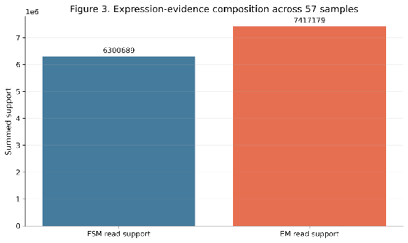

**Per-sample read support.** Transcript-assigned read support for each of the 57 retained samples (logarithmic axis), illustrating substantial differences in effective transcriptomic depth across the cohort.

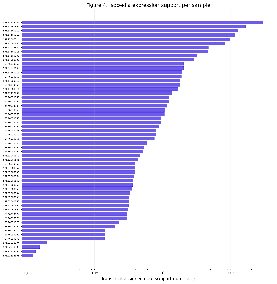

**Population-prevalence distribution.** For each Ensembl transcript, prevalence is the number of supporting samples divided by 57. The distribution is strongly skewed toward low prevalence: most annotated transcripts are supported in few or no samples.

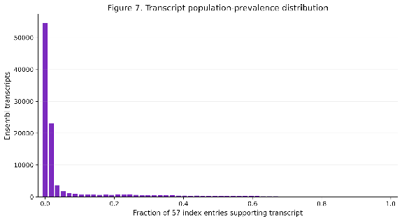

**Frequency classes.** Transcripts were assigned to mutually exclusive classes using the 57-sample denominator: not detected (0 samples), singleton (1 sample), rare (>1 sample but <10%), low (10–<25%), intermediate (25–<50%), common (50–90%), and core (>90%).

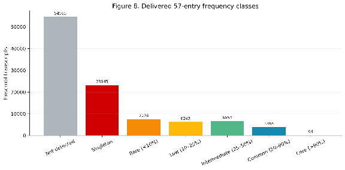

**Read support versus population prevalence.** Each hexagonal bin summarises transcripts by log10(total supporting reads + 1) and the number of supporting samples; colour denotes transcript density. Highly supported, broadly distributed transcripts separate clearly from rare or low-support transcripts.

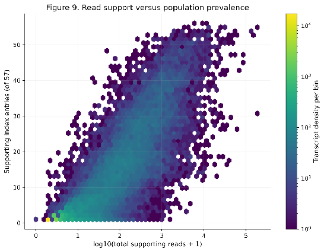

**Representative transcript-by-sample presence matrix.** Forty transcripts were selected across five prevalence bands (up to eight high-read-support transcripts per band). Dark cells denote detection in the corresponding sample.

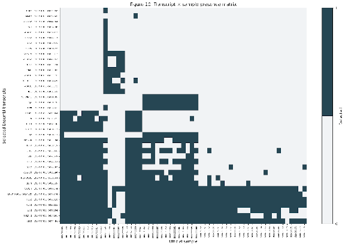

**Detected transcripts per sample.** The number of Ensembl transcripts with any Isopedia evidence in each of the 57 samples.

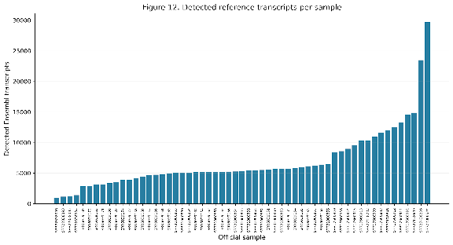

**Discovery saturation.** Samples were added in 300 deterministic random orders; the line shows the mean cumulative number of detected transcripts at each cohort size and the shaded band the 2.5th–97.5th percentile interval. The curve continues to rise at 57 samples — the cumulative discovery set (47,575 transcripts) is not yet saturated, indicating that additional samples would still reveal new supported isoforms.

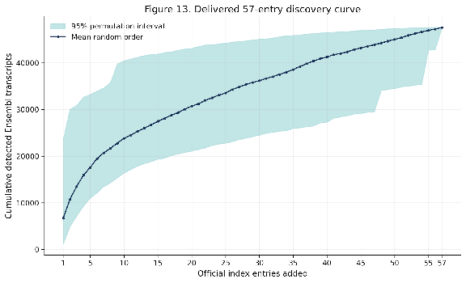 

---

### **Goal 3 — Human–chimpanzee transcript correspondence**

Because no usable precomputed transcript-level mapping exists for `NHGRI_mPanTro3-v2.1_pri` (TOGA and UCSC chains target panTro6 / Clint_PTRv2), the correspondence is established in two stages: first anchor each human gene to a chimpanzee ortholog locus, then compare transcript structures within each anchored pair. Results below cover the sequence-conservation screen (Stage 0) and the gene-projection table (Stage 1); transcript projection and intron-chain matching (Stages 2–4) are in progress.

**Sequence-conservation screen.** Human transcript cDNAs extracted from GENCODE were screened against the chimpanzee genome with a k-mer sketch comparison and binned as highly conserved, conserved, divergent, or no hit. Protein-coding and MANE Select transcripts are almost entirely conserved or highly conserved, and their identity to the best chimpanzee transcript concentrates above 97.5%. lncRNAs and pseudogenes carry the large majority of divergent and no-hit calls. This screen is used to prioritise and flag difficult genes only — the absence of a k-mer match is not treated as evidence that a transcript is absent in chimpanzee, since the formal criterion is splice-structure agreement at the orthologous locus rather than full-length cDNA identity.

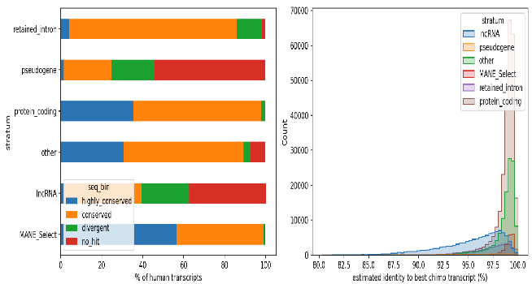

**Gene-anchor outcomes.** NCBI ortholog assignments for the chimpanzee RefSeq annotation (GCF_028858775.2, RS_2026_05) provided 17,903 human–chimpanzee ortholog pairs, all strictly one-to-one by construction, anchoring 17,910 human genes. Coverage is strongly biotype-dependent: 17,869 of 20,107 protein-coding genes (88.9%) received a unique chimpanzee locus, whereas the unanchored remainder is overwhelmingly non-coding. Genes with no NCBI ortholog assignment (28,156 total, 1,667 protein-coding) and genes that could not be linked to an Entrez GeneID (32,650 total, 560 protein-coding — predominantly lncRNAs and pseudogenes) were not projected. Six anchored genes fall in loci that lack transcript models in the chimpanzee annotation.

| Orthology class | lncRNA | other | protein_coding | pseudogene | Total |
| ----- | ----: | ----: | ----: | ----: | ----: |
| One-to-one ortholog | 31 | 0 | 17,869 | 10 | 17,910 |
| Ortholog not in RefSeq GTF | 4 | 0 | 5 | 2 | 11 |
| Ortholog absent from annotation | 0 | 0 | 6 | 0 | 6 |
| No NCBI ortholog | 8,838 | 6,186 | 1,667 | 11,465 | 28,156 |
| GeneID mapping failure | 25,993 | 2,375 | 560 | 3,722 | 32,650 |
| **Total** | **34,866** | **8,561** | **20,107** | **15,199** | **78,733** |

Since every alignment in the following stages is confined to a pre-established ortholog locus, paralog mis-mapping is excluded by construction and each failure is attributable to a specific cause — no ortholog gene, unalignable transcript, or structural divergence.

## Presentation

https://docs.google.com/presentation/d/1652ACNfKNP-Lszs3GGba00wYlToAjHXfQ3Shde4UDLc/edit?usp=sharing

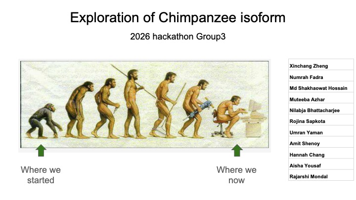

---
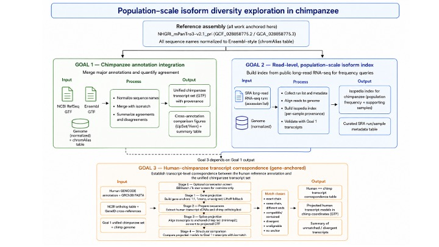

---
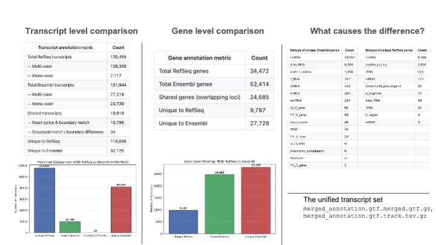

---
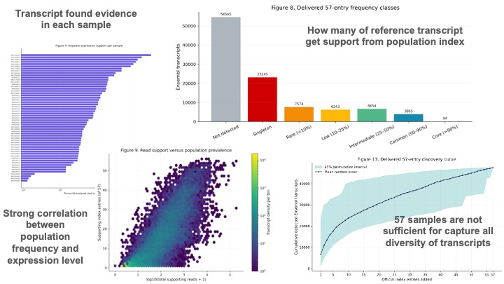

---
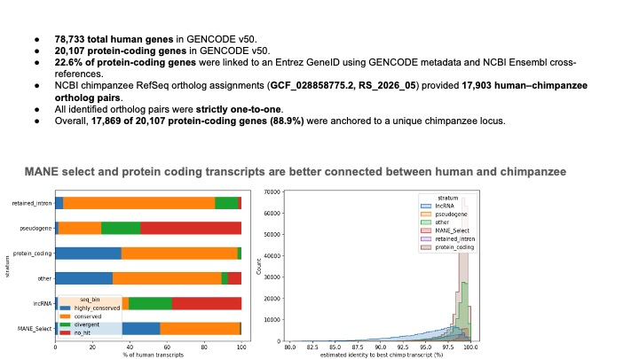

## Team

- Xinchang Zheng
- Numrah Fadra
- Md Shakhaowat Hossain
- Muteeba Azhar
- Nilabja Bhattacharjee
- Rojina Sapkota
- Umran Yaman
- Amit Shenoy
- Hannah Chang
- Aisha Yousaf
- Rajarshi Mondal
